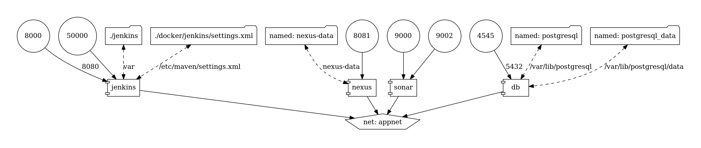

# Dockerized CI/CD Environment

#### A simple dockerized environment for CI/CD pipelines, designed to accelerate your workflow.



## Main Tools :

There are 4 containers running :

  - Jenkins Container (for pipelines).
  - Nexus Container (artifats manager).
  - SonarQube Container (code quality).
  - Postgres Container (database used by sonar).

You can find/change the port mapping in the `docker-compose.yml` file.
  - **8000** -> Jenkins
  - **8081** -> Nexus
  - **9000** -> Sonar

## How To install :

Start first with building the images, by running the script `build` inside the docker folder:

```bash
$ ./build
```

It will build three images : *Jenkins*, *Nexus* and  *Sonar*.

After that, you can start the environment (It will take some time depending on your hardware) :

```bash
$ docker-compose up
```

To see the logs :

```bash
$ docker logs -f
```

## Notes
For first time use, you need to create two repository in nexus named :
 - nexus-snapshots
 - nexus-releases

Be aware that you need to change the dockerfile to meet your environment. I have intended to use it for Java Projects, so you will see some pre-defined configurations and tools already installed (*maven* ...).
You can specify other images, or your images in the `docker` directory and install whatever you need then.

## Maintainer

> [Ayoub ED-DAFALI]()
